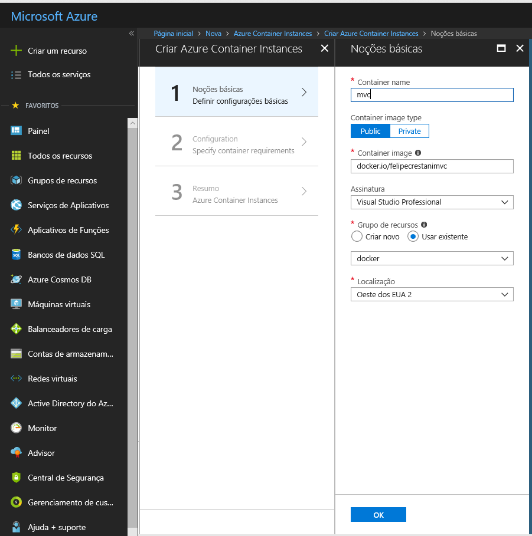
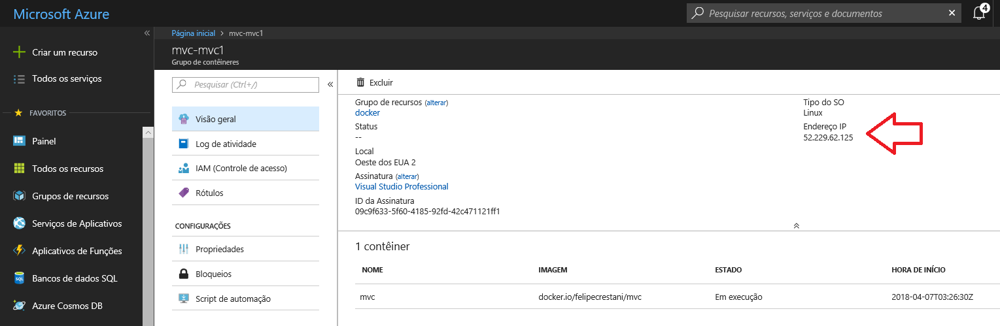

# Azure BootCamp 2018 - Lab ASP.NET Core MVC + Docker

### Verificar instalação do Docker

```
docker --version
```

Instalação: https://store.docker.com/search?type=edition&offering=community

### Rodar um Container Linux no Windows

```
docker run -t felipecrestani/hab
```

### Verificar versão do .Net Core instalado

```
dotnet --version
```

Instalação: https://www.microsoft.com/net/learn/get-started/windows


### Criar um novo site MVC ASP.NET Core

Criar uma nova pasta do site e executar o comando abaixo:

```
dotnet new mvc --auth Individual
```

--auth Individual cria o site com autenticação integrada

Na pasta raiz do site MVC executar:

```
dotnet run
```

Acessar a porta http://localhost:5000


# Docker

## Definições

- Dockerfile - Arquivo de Script para criar a imagem
- Image - Imagem docker compilada
- Registry - Repositório de imagens
- Container - Imagem docker em execução


## Comandos Básicos

```PowerShell
# Help
docker -help

# List Containers
docker ps -a 

# List Images
docker images

# Stop Container
docker stop [ID]

# Remove Container
docker rm [ID] --force

# Remove image
docker rmi [ID] --force

## WARNING ##

# Stop all Containers
docker stop $(docker ps -a -q)

# Remove all Containers (*WARNING*)
docker rm $(docker ps -a -q)

```


## Dockerfile

Na pasta raiz do site mvc criar um arquivo com o nome dockerfile e adicionar o script abaixo

```Dockerfile
FROM microsoft/aspnetcore-build:2.0 AS build-env
WORKDIR /app

# Copy csproj and restore as distinct layers
COPY *.csproj ./
RUN dotnet restore

# Copy everything else and build
COPY . ./
RUN dotnet publish -c Release -o out

# Build runtime image
FROM microsoft/aspnetcore:2.0
WORKDIR /app
COPY --from=build-env /app/out .
ENTRYPOINT ["dotnet", "mvc.dll"]
```

No ENTRYPOINT alterar o nome da dll para o nome do seu projeto.

## Docker Build

Na pasta raiz do projeto executar:

```
docker build -t mvc .
```

Consultar a imagem gerada

```
docker images
```

## Executar a Imagem

Docker executa a imagem na porta 80
```
docker run -d -p 8080:80 --name mvc [mvc]
```

Acessar http://localhost:8080


### Docker Hub

O docker hub é um repositório de imagens da própria Docker, que permite qualquer um hospedar suas imagens.

Criar o login em https://hub.docker.com

Logar no repositório
```
docker login
```

Enviar imagem para Docker Hub
```
docker push felipecrestani/mvc
```

Acessar https://hub.docker.com

## Deploy no Azure Container Instances

Logar no https://portal.azure.com

Criar um recurso do Azure Container Instances



Acessar o IP público do serviço




# Azure Bootcamp 2018 - Obrigado :)


